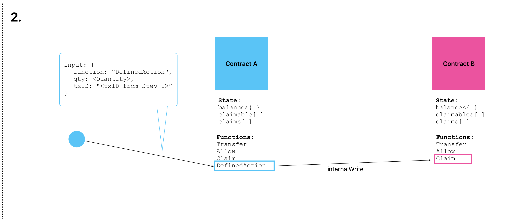
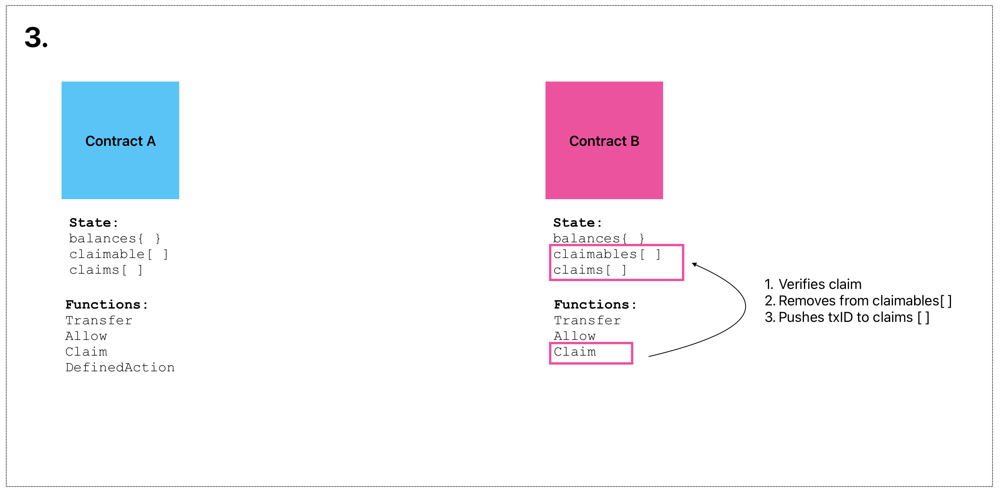
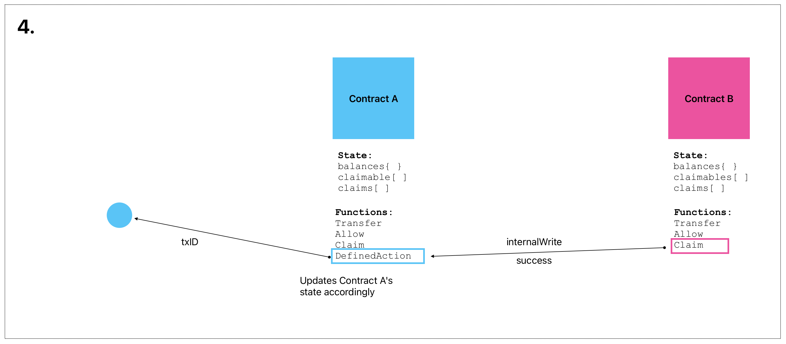

# Foreign Call Protocol v2

**Status:** Draft
**Authors:** Joe Berenbaum (joe@arceum.co)

## Abstract
This document describes the second iteration of the Foreign Call Protocol (FCP).  The FCP is required for projects that want to leverage features such as [Verto Flex](https://github.com/useverto/flex) and multi-sig technologies like [AFTR Market](https://aftr.market).

## Motivation

In May, 2021, the Foreign Call Protocol (FCP) was released as a way to allow SmartWeave contracts to communicate interoperably.  More specifically, giving contracts a way to invoke functions on other contracts remotely.

FCP was a step forward for the Arweave ecosystem, but with the release of Warp’s internalWrites, an updated solution was proposed, but never fully documented.  Several projects have implemented this new method and our intent is to bring this method to light with the hopes of community adoption so that cross-contract interoperability becomes a standard for more protocols to take advantage of.

## Specification

### How It Works
To understand what is required and how this works, let's take a look at an example. In our example, Contract A is going to call the transfer function on Contract B.  Because Contract A doesn't have a balance on Contract B, that interaction will be rejected unless contract interoperability is support by both contracts. So, for purposes of our example, we'll assume that both contracts support this specification.

The process will work like this:
 to Contract B telling the contract to expect a remote call from Contract A. This *claim* is stored in Contract B's **claimables[ ]**.")

1. An **Allow** interaction is sent by a authorized caller (i.e. a wallet that is in Contract B's balances object) to Contract B telling the contract to expect a remote call from Contract A. This *claim* is stored in Contract B's **claimables[ ]**.


2. An interaction on Contract A runs which includes the remote call to Contract B. In this interaction, Contract A remotely calls Contract B's **claim** function to *claim* its approved transfer.


3. As Contract B runs its **claim** function, it updates the balance to reflect the transfer, removes the corresponding object from its **claimables[ ]**, and adds the transaction ID to its **claims[ ]** for a log of the history.


4. Contract A can now do what it needs to to update it's own state now that the transfer has been claimed. 

### Requirements
In order for protocols to communicate remotely, they need to ensure 2 additional properties are in their state and 2 additional functions are available in their contract.

#### State Modifications
The following parameters need to be added to a contracts state.  Note that if your state does not have these properties, the allow and claims functions will add them.
1. claimable[ ]
2. claims[ ]

#### Functions
The following functions need to be added to your contract:
1. allow
```javascript
if (input.function === "allow") {
    if (!functions.includes("allow")) {
        throw new ContractError("The allow function is not allowed in this repo.");
    }

    target = input.target;
    const quantity = input.qty;

    if (!Number.isInteger(quantity) || quantity === undefined) {
        throw new ContractError("Invalid value for quantity. Must be an integer.");
    }
    if (!target) {
        throw new ContractError("No target specified.");
    }
    if (target === SmartWeave.contract.id) {
        throw new ContractError("Can't setup claim to transfer a balance to itself.");
    }
    if (quantity <= 0 || caller === target) {
        throw new ContractError("Invalid balance transfer.");
    }
    if (balances[caller] < quantity || !balances[caller] || balances[caller] == undefined || balances[caller] == null || isNaN(balances[caller])) {
        throw new ContractError("Caller balance not high enough to make a balance of " + quantity + "claimable.");
    }

    balances[caller] -= quantity;

    state.claimable.push({
        from: caller,
        to: target,
        qty: quantity,
        txID: SmartWeave.transaction.id,
    });
}
```

2. claim
```javascript
if (input.function === "claim") {
    if (!functions.includes("claim")) {
        throw new ContractError("The claim function is not allowed in this repo.");
    }

    // Claim input: txID
    const txID = input.txID;
    // Claim qty
    const qty = input.qty;

    if (!state.claimable.length) {
        throw new ContractError("Contract has no claims available.");
    }
    // Search for txID inside of `claimable`
    let obj;
    let index = -1;
    for (let i = 0; i < state.claimable.length; i++) {
        if (state.claimable[i].txID === txID) {
            index = i;
            obj = state.claimable[i];
        }
    }
    if (obj === undefined) {
        throw new ContractError("Unable to find claim.");
    }
    if (obj.to !== caller) {
        throw new ContractError("Claim not addressed to caller.");
    }
    if (obj.qty !== qty) {
        throw new ContractError("Claiming incorrect quantity of tokens.");
    }
    // Check to make sure it hasn't been claimed already
    for (let i = 0; i < state.claims.length; i++) {
        if (state.claims[i] === txID) {
            throw new ContractError("This claim has already been made.");
        }
    }
    // Not already claimed --> can claim
    if (!balances[caller]) {
        balances[caller] = 0;
    }
    balances[caller] += obj.qty;

    // remove from claimable
    state.claimable.splice(index, 1);

    // add txID to `claims`
    state.claims.push(txID);
}
```

